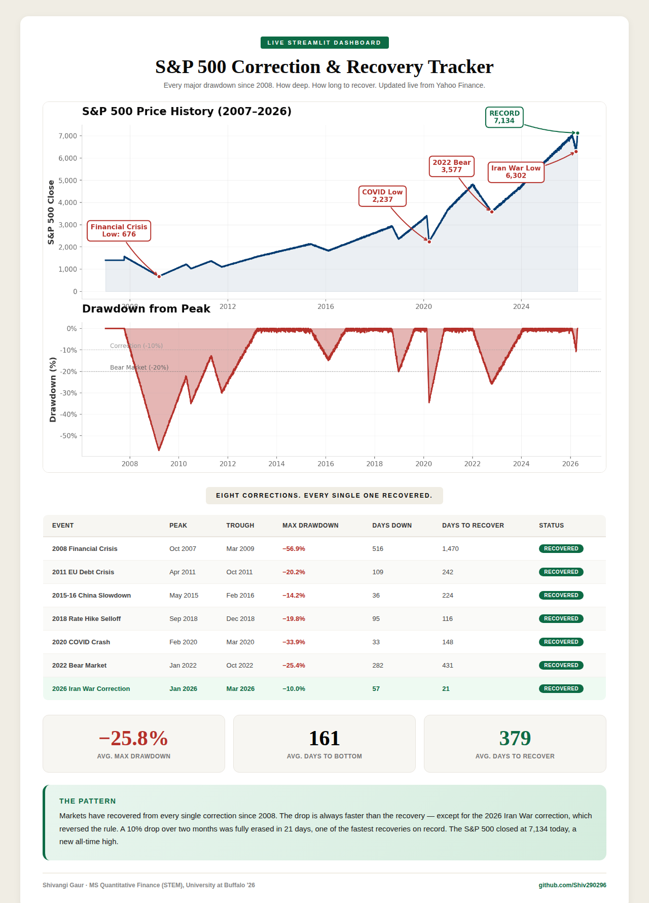

# S&P 500 Correction & Recovery Tracker

A live Streamlit dashboard that tracks every **10%+ S&P 500 correction since 2008**, then measures how deep each drawdown went and how long it took to fully recover.

> In April 2026, the S&P 500 crossed the 7,000 level for the first time in history. Just weeks earlier, it was in correction territory. This project asks a simple question: **how unusual was that rebound when you compare it with every major correction since 2008?**



## Why this exists

Market commentary often feels binary in the moment.

One week the narrative is recession, geopolitics, oil, volatility, and downside risk. A few weeks later, the index is printing a new all-time high.

I wanted to stop looking at corrections as isolated headlines and start looking at them as a repeatable historical pattern.

This dashboard does exactly that.

## What the dashboard shows

- **Live S&P 500 price history** from 2007 onward, refreshed from Yahoo Finance
- **Automatic drawdown detection** for every 10%+ correction from a running peak
- **Peak, trough, and recovery dates** for each correction cycle
- **Days down vs. days to recover** so the speed of each selloff and rebound is easy to compare
- **Current market context** placed alongside the last 18 years of correction history

## What stood out in the data

- **2008 Financial Crisis:** 56.9% drawdown, 1,470 days to recover  
- **2020 COVID Crash:** 33.9% drawdown, 148 days to recover  
- **2022 Bear Market:** 25.4% drawdown, 431 days to recover  
- **2026 Iran War Correction:** 10.0% drawdown, 21 days to recover  

The broad pattern is simple: every correction in the dataset eventually recovered.

The interesting part is the **speed**. Most drops happen faster than the recovery. The latest correction reversed that pattern and snapped back unusually quickly.

## Tech stack

| Layer | Tool |
|---|---|
| Data | `yfinance` |
| Data wrangling | `pandas`, `numpy` |
| Visualization | `plotly` |
| App framework | `streamlit` |

## Run locally

```bash
git clone https://github.com/Shiv290296/SP500-Correction-Recovery-Tracker.git
cd SP500-Correction-Recovery-Tracker
pip install -r requirements.txt
streamlit run app.py
```

Then open `http://localhost:8501` in your browser.

No API key. No setup friction. Just run the app and the market data loads live.

## How the correction logic works

The logic is intentionally simple and transparent:

1. Track the S&P 500 closing price and its rolling all-time high
2. Compute drawdown from that peak on each date
3. Flag a correction when drawdown reaches **-10% or worse**
4. Track the trough and mark recovery once price closes back at or above the prior peak

No black-box signal library is used for the correction detection itself. The core logic is custom and easy to inspect.

## Why I like this project

This is the kind of work I enjoy most: taking a noisy market narrative, structuring it with data, and turning it into something visually clear and decision-useful.

It sits at the intersection of:
- markets
- historical pattern recognition
- data visualization
- lightweight financial tooling

## Author

**Shivangi Gaur**  
MS Quantitative Finance, University at Buffalo  
Graduating June 2026

- LinkedIn: [linkedin.com/in/shivangi-gaur](https://www.linkedin.com/in/shivangi-gaur)
- GitHub: [github.com/Shiv290296](https://github.com/Shiv290296)
